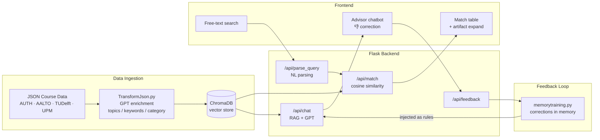

# ERASMUS MATCHER AI 
> **Study Without Borders**:  An intelligent semantic search engine and AI chatbot that helps university students find the best matching courses for their Erasmus+ exchange programs.

Made by **Stack Underflow** for the **2026 hackathon by Netcompany**

## THE PROBLEM
> Currently, finding matching courses between a home university and a host university abroad is a highly manual, bureaucratic, and tedious process. Students spend weeks reading hundreds of pages of PDF syllabuses in foreign languages, trying to guess which courses correspond to their curriculum.

## OUR SOLUTION
> **ErasmusMatcher AI** completely automates this process using Large Language Models and Vector Databases. 
Instead of relying on exact keyword matches, our engine understands the **semantic meaning** and academic concepts of each course, bridging the language gap and providing accurate matching percentages instantly.

### Key Features
* **Semantic Matching (Cosine Similarity):** We use `text-embedding-3-small` to match courses based on actual academic concepts, not just superficial titles.
* **Conversational AI Interface:** Harnessing the power of `gpt-5.1` we gather user parameters and answer contextual questions about the matched courses.
* **Zero-Cost Search:** The application loads the embeddings from ChromaDB and performs **Cosine Similarity** calculations locally using `numpy`, resulting in lightning-fast, 0-cost queries.
* **Highly Extensible Architecture:** Built with ChromaDB using an **Upsert** mechanism and composite unique IDs. New universities can be added to the database without rebuilding it.
* **Automated Data Pipeline:** Raw unstructured syllabuses are automatically cleaned, translated to English (acting as a universal semantic bridge), and structured via OpenAI before embedding.
* **Conversational Memory** Using a thumbs up/down system the user can provide feedback which is then used to improve answers
regarding user preferences.

## Tech Stack
* **Backend:** Python 3.11, Flask
* **AI & Embeddings:** OpenAI API (`gpt-5.1`, `text-embedding-3-small`)
* **Vector Database:** ChromaDB, Langchain
* **Math / Algorithms:** NumPy (Cosine Distance/Similarity calculations, Sigmoid Stretching)
* **Frontend:** Vanilla HTML/CSS/JS (Zero dependency, ultra-lightweight)
* **DevOps:** Docker & Docker Compose




## How to Run Locally with Docker

Running the project is incredibly easy using Docker.

**1. Clone the repository**
```bash
git clone https://github.com/jimtsiolak20-droid/CourseMatcherErasmus
```

```bash
cd CourseMatcherErasmus
```

**2. Setup Environment Variables**

Copy the example environment file...

```bash
copy .env.example .env
```

```bash
notepad .env
```
and replace with your OpenAI API Key.

**3. Build and Start the Application**

```bash
docker-compose up --build
```

**4. READY TO GO !!!**

Open your browser and navigate to: http://localhost:8080